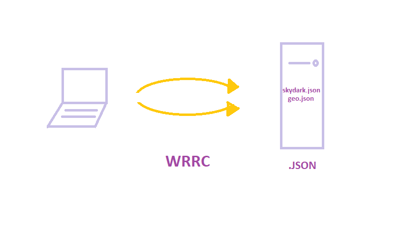

# city_explorer_api

Number and name of feature: Repository Set Up

Estimate of time needed to complete: 30 min

Start time: 2:00pm

Finish time: 2:20pm

Actual time needed to complete: 20 min

Number and name of feature: Locations: As a user of City Explorer, I want to enter the name of a location so that I can see data about the area of interest to me.

Estimate of time needed to complete: 30 min

Start time: 2:30pm

Finish time: 3:00pm

Actual time needed to complete: 30 min

Number and name of feature: Weather: As a user, I want to request current weather information so that I can learn more about the typical weather patterns in the location I had entered.

Estimate of time needed to complete: 1 hour

Start time: 3:00pm

Finish time: 4:30pm

Actual time needed to complete: 1 hour and half

Number and name of feature: Errors: As a user, I want clear messages if something goes wrong so I know if I need to make any changes or try again in a different manner.

Estimate of time needed to complete: 30 min

Start time: 4:30pm

Finish time: 5:00pm

Actual time needed to complete: 30 min 